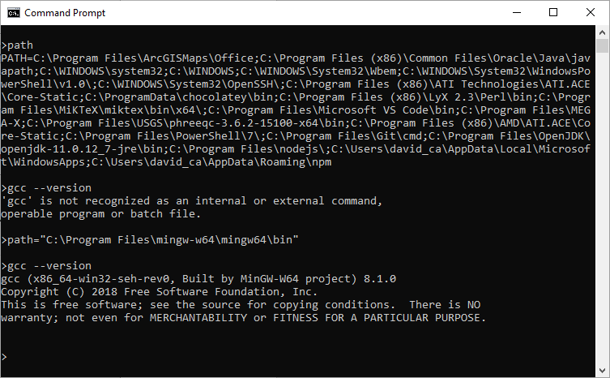
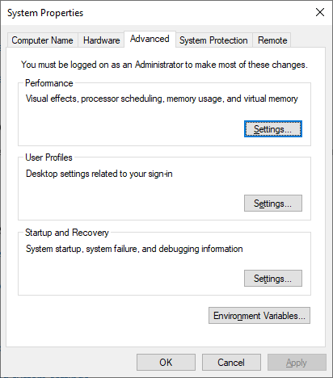
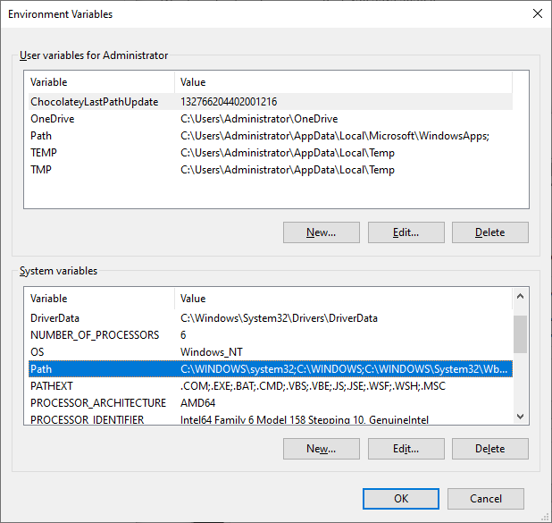

# How To Configure Visual Studio Code with gcc compiler (C & C++)

## 1. Install .NET SDK (x64)

Install the current release for [.net sdk x64](https://dotnet.microsoft.com/download/visual-studio-sdks)

_It is necessary to install the .net sdk in order to debug C code._

## 2. Install MinGW-64

_MinGW-64 project is a port of gcc compiler for Windows OS._

Install [MinGW-64](https://www.mingw-w64.org/) with the following considerations:

Install Mingw-W64-builds

Choose the folowing settings

Choose the following installation path

* It seems modifying the default installtion path effects the installer from adding the folder directory to Windows PATH.

Check Windows command shell (CMD) (a.k.a. Terminal) if folder was automatically added to PATH environment variable

_The WinGW-64 BIN folder can be added manually either by Windows GUI Advanced System Settings, or via commandline._

#### Add the `MinGW-64\mingw64\bin` directory with Advanced system settigns GUI

_Changing system environmental variables requires administratove privelege._

Open Advanced System properties

Open _"Environmental Variables..."_

"Edit" Path variable

add `%ProgramFiles%\mingw-64\mingw64\bin`

#### Add the BIN directory via commandline

`setx PATH "%PATH%;%ProgramFiles%\mingw-64\mingw64\bin" /M`

The Windows registry key that stores system environmental variables:

`[HKEY_LOCAL_MACHINE\SYSTEM\CurrentControlSet\Control\Session Manager\Environment]`
`Value=Path`

Test that gcc.exe is found --without having to path the entire explicit directory.

`gcc.exe --version`

Should result in --if configured correctly.

## 3 Visual Studio Code extension(s)

Install C/C++ (from Microsoft) extension

## 4 Visual Studio Code Compile with gcc

***Be sure to select C++ (GDB/LLDB) when compiling code!***

_If you select C++ (Windows) by mistake, the whole thing is FUBAR! Might as well NUKE your system now._

---

Keyboard shortcut for compile: Ctrl + shift + B

This should produce a .exe file in the current directory

- When compiling, a [launch.json](./samples/launch.json) and [tasks.json](./samples/tasks.json) will be created in the current directory in folder `.vscode`

## 5 Visual Studio Code Run and Debug

